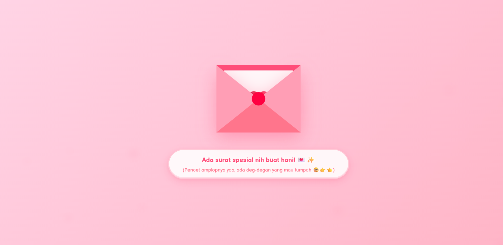
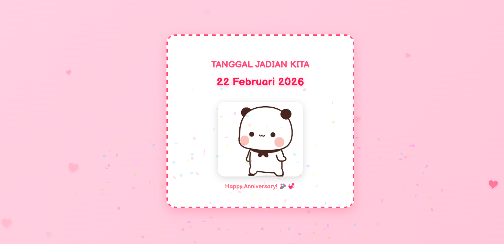

# 💌 forU - Buat Kamu (Interactive Digital Gift)


**forU (Buat Kamu)** adalah sebuah aplikasi web full-stack interaktif yang dirancang khusus untuk memberikan pesan romantis, gombalan, atau kejutan digital kepada seseorang. Aplikasi ini sangat interaktif, menghadirkan efek visual, musik latar otomatis, dan tombol "No" yang bisa menghindar saat diklik!

Selain itu, setiap interaksi target (apakah mereka berhasil menekan "Yes" dan berapa kali mereka mencoba menekan "No") akan dicatat ke dalam database dan langsung dikirimkan ke **Discord** kamu secara _real-time_!

---

## 📸 Preview Antarmuka

<p align="center">
  <table align="center" border="0" cellpadding="0" cellspacing="0" style="width: 100%; border-collapse: separate; border-spacing: 15px;">
    <tr>
      <td align="center" width="50%">
        
      </td>
      <td align="center" width="50%">
        
      </td>
    </tr>
    <tr>
      <td align="center" style="padding-top: 10px;"><b>Halaman Awal (Landing Page)</b></td>
      <td align="center" style="padding-top: 10px;"><b>Halaman Interaktif (Hasil Gombalan)</b></td>
    </tr>
  </table>
</p>

---

## ✨ Fitur Utama

### 🎨 Frontend (UI/UX)

- **Interactive "No" Button**: Tombol "No" akan kabur/menghindar secara acak apabila pengguna mencoba mengekliknya lebih dari 3 kali.
- **Autoplay Background Music**: Musik latar romantis yang berjalan otomatis setelah interaksi pertama pengguna.
- **Dynamic Images & Text**: Gambar GIF romantis dan teks gombalan yang berubah-ubah tergantung respon target.
- **Heart Effect Animation**: Efek animasi hujan hati (love) berjatuhan di latar belakang.
- **Responsive Design**: Mendukung tampilan mobile (HP) maupun desktop dengan baik.
- **URL Parameter Parsing**: Bisa merender nama target secara dinamis via URL (Contoh: `/?target=Ayang`).

### ⚙️ Backend & Integrasi

- **Real-time Discord Notification**: Notifikasi otomatis ke server Discord melalui Webhook/Bot setiap kali target mengklik "Yes".
- **Interaction Data Logging**: Menyimpan log interaksi pengguna ke dalam database MongoDB.
- **CORS Enabled**: Mendukung _Cross-Origin Resource Sharing_ antara frontend dan backend.

---

## 🛠️ Tech Stack

Project ini dikembangkan menggunakan teknologi modern:

### Frontend

- **Framework**: React 19
- **Build Tool**: Vite
- **Language**: TypeScript
- **Styling**: Vanilla CSS3 (Custom Styles & Animations)

### Backend

- **Runtime**: Node.js
- **Framework**: Express.js 5
- **Database**: MongoDB (dipadukan dengan Mongoose)
- **Integration**: Discord.js v14 & node-fetch

---

## 📁 Struktur Project

```text
forU/
├── backend/                  # REST API & Discord Bot Logic
│   ├── models/               # Skema Database Mongoose (Interaction)
│   ├── utils/                # Utility (Discord bot & Webhook API)
│   ├── server.js             # Entry point backend
│   ├── package.json          # Dependencies backend
│   └── .env.example          # Contoh variabel environment backend
│
├── frontend/                 # Aplikasi Web React (UI)
│   ├── src/
│   │   ├── assets/           # Gambar, musik, atau file statis lainnya
│   │   ├── components/       # Reusable components (Gombalan.tsx, HeartEffect.tsx)
│   │   ├── App.tsx           # Main application logic
│   │   ├── main.tsx          # Entry point aplikasi React
│   │   └── App.css & index.css # Styling utama
│   ├── index.html            # Template HTML
│   ├── vite.config.ts        # Konfigurasi Vite bundler
│   └── package.json          # Dependencies frontend
└── README.md                 # Dokumentasi project (File ini)
```

---

## ⚙️ Cara Instalasi & Menjalankan Project Lokal

Karena project ini terdiri dari **Frontend** dan **Backend**, kamu perlu menjalankan keduanya secara terpisah.

### 1. Persiapan Awal

Pastikan kamu telah menginstal:

- [Node.js](https://nodejs.org/) (Versi LTS terbaru)
- [MongoDB](https://www.mongodb.com/try/download/community) (Lokal atau MongoDB Atlas)
- Token Bot Discord atau Webhook URL (untuk fitur notifikasi)

### 2. Setup Backend

```bash
# Pindah ke direktori backend
cd backend

# Install semua dependencies
npm install

# Copy pengaturan environment
cp .env.example .env
```

**Konfigurasi Variabel Environment (`backend/.env`):**
Buka file `.env` dan sesuaikan nilainya:

```env
PORT=5000
MONGODB_URI=mongodb://localhost:27017/forU
DISCORD_WEBHOOK_URL=url_webhook_discord_kamu
DISCORD_BOT_TOKEN=token_bot_discord_kamu
```

Jalankan Server Backend:

```bash
npm run dev
# Atau
node server.js
```

_Backend akan berjalan di: `http://localhost:5000`_

### 3. Setup Frontend

Buka terminal baru (_new terminal_), dan jalankan:

```bash
# Balik ke direktori utama, lalu masuk ke frontend
cd frontend

# Install semua dependencies
npm install

# Jalankan server frontend
npm run dev
```

_Frontend akan berjalan di: `http://localhost:5173` (cek terminal Vite untuk URL pastinya)_

---

## 🚀 Dokumentasi Penggunaan

1. Buka browser dan arahkan ke alamat frontend (misal: `http://localhost:5173`).
2. **Kustomisasi Halaman untuk Seseorang:**
   Kamu dapat menambahkan nama target di akhir URL menggunakan parameter `target`.
   Contoh: `http://localhost:5173/?target=Nadia`
   Teks utama akan secara otomatis berubah menjadi: `"Nadia, apakah kamujh sayang ak?"`
3. Begitu target berhasil mengklik tombol **"Yes"**, backend otomatis mencatat respons tersebut ke MongoDB dan ngirim pesan ke Discord kamu.

---

## ☁️ Deployment

- **Frontend** bisa di-host dengan mudah menggunakan **Vercel**, **Netlify**, atau **Cloudflare Pages** (menggunakan instruksi build `npm run build`).
- **Backend** membutuhkan server Node.js atau VPS seperti **Render**, **Railway**, atau **Heroku**.
- **Database** bisa di-hosting menggunakan layanan gratis seperti **MongoDB Atlas**.

---

## 📄 Lisensi

Project ini dibuat untuk tujuan pembelajaran, hiburan, dan memberi hadiah manis kepada seseorang. Bebas digunakan, dicloning, dan dimodifikasi sesukamu.

_Code with ❤️ by Kanjirouu._
