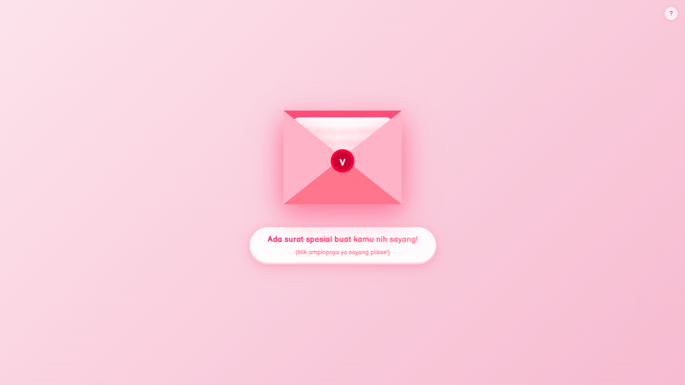
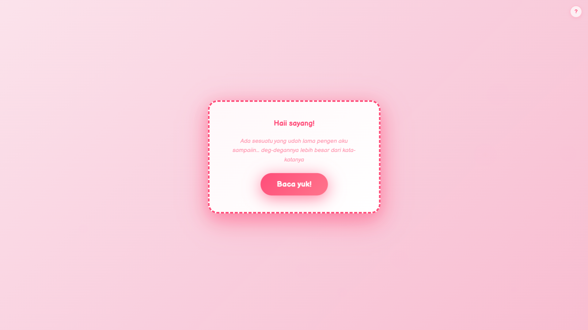
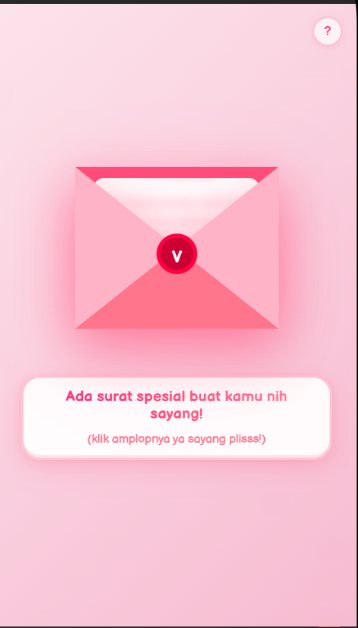

# 💌 forU - Buat Kamu (Interactive Love Confession Web)

<p align="center">
  
  
  
  
</p>

**forU (Buat Kamu)** adalah web interaktif untuk nembak doi secara kreatif! Kirim link spesial lewat Discord atau langsung, lengkap dengan animasi amplop, countdown, dan tombol "gamau" yang lari-larian.

Kalau doi jawab **"IYA mau!"**, confetti bertebaran, lagu romantis menyala, dan notifikasi otomatis masuk ke Discord kamu! 💖

---

## 📸 Preview

<div align="center">
  <table>
    <tr>
      <td align="center">
        
        <br/>
        <sub>Tampilan Desktop ( Halaman utama )</sub>
      </td>
      <td align="center">
        
        <br/>
        <sub>Tampilan Desktop ( Halaman target )</sub>
      </td>
    </tr>
    <tr>
      <td colspan="2" align="center">
        
        <br/>
        <sub>Tampilan Mobile ( Halaman utama )</sub>
      </td>
    </tr>
  </table>
</div>

---

## ✨ Fitur Utama

### 🎬 Pengalaman Interaktif
* **Animasi Amplop** — Klik amplop untuk reveal pesan dengan animasi GSAP smooth.
* **Countdown Dramatis** — Hitung mundur 3… 2… 1… sebelum memunculkan pesan inti.
* **Tombol "gamau" Kabur** — Tombol bergerak menghindar (transform-based) saat coba diklik.
* **Confetti & Lagu** — Efek selebrasi otomatis saat status berubah jadi "Accepted".

### 🎨 Visual & Audio
* **Heart Effect** — Animasi hujan hati di background untuk suasana romantis.
* **Background Music** — Musik otomatis dengan transisi crossfade ke lagu penerimaan.
* **Responsive** — Tampilan optimal di perangkat mobile maupun desktop.

### ⚙️ Backend & Discord
* **Discord Bot** — Command `!tembak` atau `!gombal` untuk generate link spesial secara otomatis.
* **Discord Webhook** — Notifikasi real-time ke server saat doi klik "IYA mau!".

---

## 🛠️ Tech Stack

### Frontend
| Tech | Versi |
| :--- | :--- |
| **React** | 19 |
| **Vite** | 7 |
| **TypeScript** | 5.9 |
| **GSAP** | 3.14 |

### Backend
| Tech | Deskripsi |
| :--- | :--- |
| **Node.js** | LTS Version |
| **Express.js** | Version 5 |
| **Discord.js** | Version 14 |

---

## 🚀 Instalasi & Setup

### 1. Backend
```bash
cd backend
npm install
# Konfigurasi .env (PORT, DISCORD_BOT_TOKEN, DISCORD_WEBHOOK_URL, FRONTEND_URL)
node server.js
```

### 2. Frontend
```bash
cd frontend
npm install
npm run dev
```

---

## 📄 Lisensi

Project ini dibuat untuk hiburan dan personal. Bebas dimodifikasi.

Code with ❤️ by **Kanjirouu**.